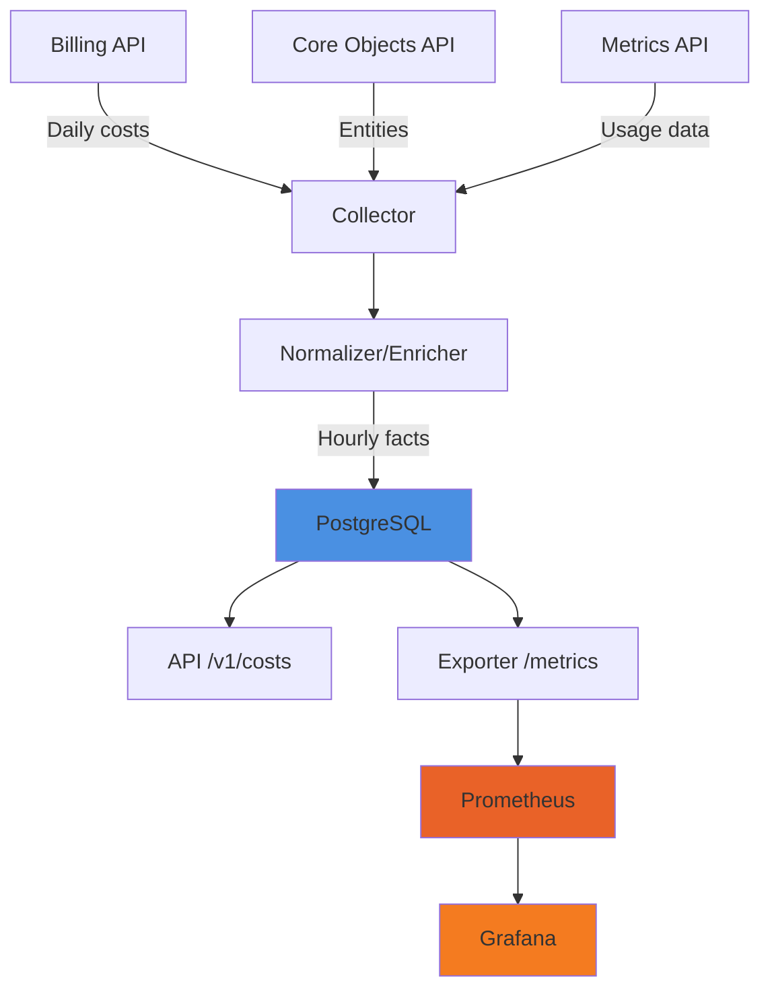

# Confluent Billing Portal

A chargeback/showback platform for Confluent Cloud that transforms daily billing data into hourly cost datasets, correlates with entities and metadata, and exposes data via Prometheus/Grafana and REST API.

---

Uma plataforma de chargeback/showback para Confluent Cloud que transforma dados de faturamento diário em datasets de custo por hora, correlaciona com entidades e metadados, e expõe dados via Prometheus/Grafana e API REST.

---

## Features

- **Cost Aggregation**: Transform daily billing data into hourly buckets
- **Entity Correlation**: Link costs to organizations, environments, clusters, and principals
- **Business Metadata**: Allocate costs by business unit, product, team, and cost center
- **Prometheus Metrics**: Export cost data in OpenMetrics format for Grafana
- **REST API**: Query and filter cost data programmatically
- **Confidence Scoring**: Track allocation confidence (low/medium/high)
- **6 Grafana Dashboards**: Pre-configured dashboards with SQL queries for 30+ days of historical data

## Prerequisites

- Docker 20.10+ & Docker Compose 2.0+
- Git 2.30+
- (Optional) Python 3.11+ and Poetry for local development

## Quickstart

### Option 1: Docker Compose (Recommended)

```bash
# Clone the repository
cd confluent-billing-portal

# Copy environment file
cp .env.example docker/.env
# Edit docker/.env with your Confluent API credentials

# Start all services
docker compose -f docker/docker-compose.yml up -d

# Check service health
curl http://localhost:8000/healthz
```

Services will be available at:

| Service | URL | Credentials |
|---|---|---|
| **Grafana** (dashboards) | http://localhost:3000 | admin / admin |
| **REST API** (Swagger) | http://localhost:8000/docs | — |
| **Prometheus** | http://localhost:9090 | — |
| **PostgreSQL** | localhost:5432 | billing_user / billing_password |

### Option 2: Local Development

```bash
# Install dependencies
make install

# Copy environment file
cp .env.example .env

# Run database migration (requires local Postgres)
make migrate

# Start development server
make dev
```

## API Examples

### Query Costs

```bash
# Get costs for January 2024
curl "http://localhost:8000/v1/costs?from_ts=2024-01-01T00:00:00Z&to_ts=2024-01-31T23:59:59Z&limit=10"

# Filter by organization
curl "http://localhost:8000/v1/costs?from_ts=2024-01-01T00:00:00Z&to_ts=2024-01-31T23:59:59Z&org_id=org-prod"
```

### Get Dimensions

```bash
# Get all organizations
curl "http://localhost:8000/v1/dimensions?dimension_type=orgs"

# Get all clusters
curl "http://localhost:8000/v1/dimensions?dimension_type=clusters"
```

## PromQL Examples

```promql
# Total hourly cost across all resources
sum(ccloud_cost_usd_hourly)

# Cost by cluster
sum(ccloud_cost_usd_hourly) by (cluster)

# Cost by business unit
sum(ccloud_cost_usd_hourly) by (business_unit)
```

See full PromQL cookbook: [docs/PROMQL_EXAMPLES.md](docs/PROMQL_EXAMPLES.md)

## Architecture



## Testing

```bash
make test             # Run all tests
make test-unit        # Unit tests only
make test-integration # Integration tests only
make test-smoke       # Smoke tests only
```

## Development

```bash
make format           # Format code
make lint             # Lint code
make migrate          # Apply migrations
make clean            # Clean generated files
make docker-up        # Start Docker stack
make docker-down      # Stop Docker stack
make docker-rebuild   # Rebuild and restart
```

## Project Structure

```
confluent-billing-portal/
├── src/
│   ├── api/              # REST API endpoints
│   ├── collector/        # Billing & Core Objects API clients
│   ├── enricher/         # Daily-to-hourly transformation
│   ├── exporter/         # Prometheus metrics exporter
│   ├── storage/          # Database models & repositories
│   ├── jobs/             # Scheduler (APScheduler)
│   └── common/           # Shared utilities
├── tests/                # Unit, integration, and smoke tests
├── migrations/           # Database migrations (SQL)
├── docker/               # Docker configuration
├── grafana/              # Dashboard JSON files and provisioning
├── config/               # Prometheus configuration
└── docs/                 # Documentation
```

## Grafana Dashboards

The platform includes 6 pre-configured dashboards using PostgreSQL SQL queries:

| Dashboard | File | Audience |
|---|---|---|
| C-Level Cost Overview | `clevel-cost-overview.json` | Executives, management |
| Confluent Cloud Chargeback | `ccloud_chargeback.json` | FinOps, cost managers |
| Cost by Business Unit | `cost-by-business-unit.json` | Business managers |
| Cost by Cluster | `cost-by-cluster.json` | Platform engineers, SREs |
| Historical Costs (SQL) | `historical_costs.json` | Financial analysts, audit |
| Confidence Metrics | `confidence-metrics.json` | Data quality, FinOps |

## Documentation

For detailed panel descriptions, see:
- [Full Documentation (English)](docs/README_EN.md)
- [Documentacao Completa (Portugues)](docs/README_PT.md)
- [Setup Real Data Guide](docs/SETUP_REAL_DATA.md)
- [PromQL Examples](docs/PROMQL_EXAMPLES.md)
- [API Documentation](http://localhost:8000/docs) (when running)

## Contributing

1. Create a feature branch
2. Make your changes
3. Run tests: `make test`
4. Format code: `make format`
5. Submit a pull request

   

## License

MIT License - see LICENSE file for details

## Support

For issues and questions:
- Open an issue on GitHub
- Check documentation in `/docs`

